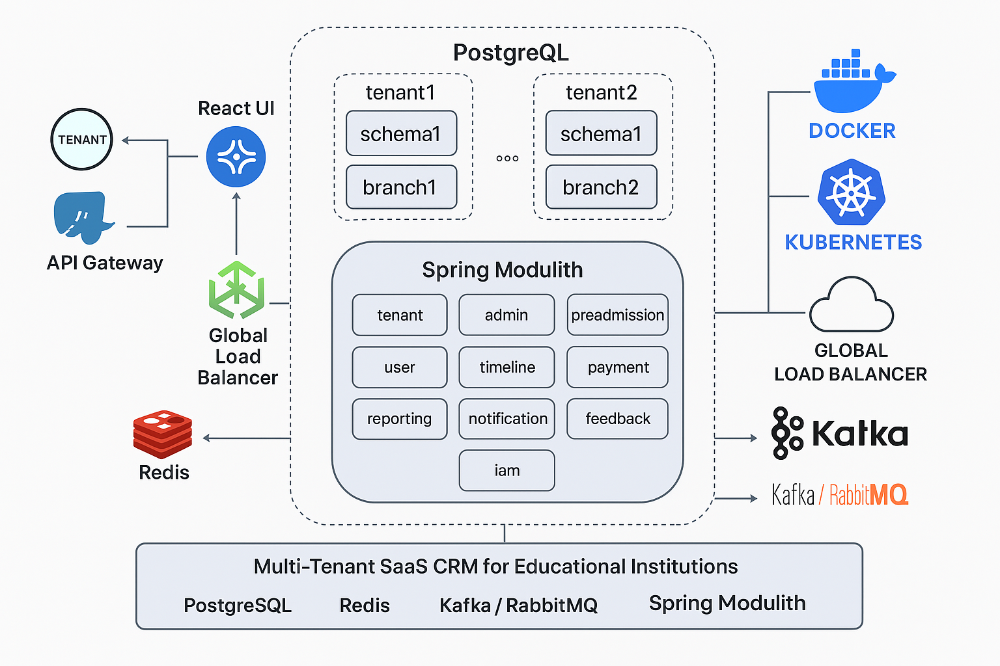
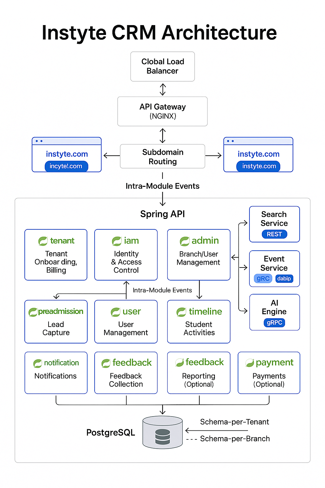

# 📘 Instyte CRM – Product Requirements Document (PRD) – Version 2

## 🧭 Version Info
**Version**: 2.2
**Date**: April 2025
**Author**: Surish

---

## 🎯 Product Vision
Instyte CRM is a scalable, modular, and multi-tenant SaaS CRM platform designed for educational institutions such as schools, colleges, and franchise-based organizations. The product enables full lifecycle management of students — from lead generation to post-admission services, attendance, feedback, and reporting.

The goal is to provide institutions with:
- Complete visibility across branches
- Custom service selection
- Transparent billing
- Scalable infrastructure
- Performance-optimized architecture

---

## 🧱 Architecture Overview
- **Multi-Tenant SaaS** using **PostgreSQL** schema-per-tenant model
- **Schema-per-branch** model to isolate data at the institution’s sub-unit level
- **Role-Based Access Control (RBAC)** enforced using **JWT tokens**
- **Spring Modulith Architecture** with `@ApplicationModule` domain boundaries and intra-module event handling
- **React-based UI** for Admins and Platform Owner
- **API-First Design** using RESTful standards
- **Cloud-Ready Deployment** (Docker, Kubernetes)
- **High Performance with Horizontal Scaling Support**

### 🧩 Spring Modulith Architecture (New)

Instyte CRM is implemented using **Spring Modulith**, which organizes the entire application as a **modular monolith**, with independent domain modules communicating via Spring Events.

| Module Name      | Purpose                                  |
|------------------|-------------------------------------------|
| `tenant`         | Tenant onboarding, schema management, billing usage |
| `iam`            | Centralized identity and access control service |
| `admin`          | Branch/user/role management              |
| `feedback`       | NPS, star ratings, student feedback       |
| `notification`   | WhatsApp/email notifications              |
| `reporting`      | Charts and data exports                   |
| `payment`        | Fee tracking and integration with gateway |
| `preadmission`   | Lead capture and follow-up                |
| `timeline`       | Activity timeline for students/events     |
| `user`           | User profiles and roles                   |

**Modulith Benefits:**
- Maintains strong modular separation with `@ApplicationModule`
- Event-driven architecture using Spring’s native `@EventListener`
- Built-in support for testing and visualizing module boundaries
- Future-ready for microservice extraction if needed
- Cleaner code organization and scalable collaboration across teams

### 🌐 High-Level Design (HLD) Enhancements

#### 🔀 Load Balancing (LB)
- Global Load Balancer for all tenants at ingress
- Dedicated Load Balancer per Tenant (Org) to isolate traffic, throttle, and rate-limit as needed

#### 🌐 API Gateway
- Central API Gateway for all platform services
- Tenant-level API gateway routing for scoped microservices (e.g., admin, leads, notifications)
- Future support for GraphQL aggregation layer

#### 🗃️ Schema Design
- Separate PostgreSQL **schema per tenant** (e.g., `dps`, `oakridge`)
- Within each tenant, a **separate schema per branch** (e.g., `dps_hyd`, `dps_blr`) for ultimate isolation

#### ⚙️ Performance-Oriented Enhancements
- Connection pooling per schema using HikariCP
- Async request handling for non-blocking flows (Spring WebFlux-ready)
- Caching layer (e.g., Redis) for repeated read queries
- Horizontal scaling of services behind gateway
- CDN support for serving static assets (React UI)
- Rate limiting per tenant at API Gateway level
- Background jobs using Quartz/Scheduler for syncs, reports, expiry reminders

---

## 🌍 Subdomain Routing (Multi-Tenant UX Enhancement)

Instyte CRM supports subdomain-level routing to offer a white-labeled, isolated experience for each tenant.

| Tenant Name       | Subdomain URL                     |
|-------------------|------------------------------------|
| Delhi Public School | https://dps.instyte.com          |
| Oakridge School     | https://oakridge.instyte.com     |

### How it works:
- Subdomains are resolved at the gateway (NGINX, API Gateway, or frontend router)
- Subdomain is extracted from the `Host` header and mapped to a tenant ID (e.g., `dps` → `dps` schema)
- JWT still includes the tenant ID for backend validation

**Benefits**:
- Professional, branded experience
- Easier scaling for white-labeling
- Improved user trust

---

## 🧩 Core Modules in Detail

### 🏢 TenantService (Internal Only)
Handles:
- Onboarding of new tenants (schools/orgs)
- Creation of `schema_name`
- Admin user creation
- Billing sync from all tenants

**APIs**:
- `POST /tenant/tenants`
- `POST /tenant/login`
- `POST /tenant/sync-usage`
- `GET /tenant/billing-summary`

**Tables**:
- `public.tenants`
- `public.users`
- `public.billing_usage`

---

### 🔐 IAM Service
Manages centralized authentication and role-based access control across the platform.

Handles:
- User login and JWT token issuance
- Role validation and access checks
- Permission mapping per role (RBAC)
- Session and token management

**APIs**:
- `POST /iam/login` — Authenticate user and issue JWT
- `GET /iam/validate` — Validate token and fetch current user info
- `GET /iam/roles` — List available roles
- `POST /iam/permissions/check` — Validate access for a specific route/resource

**Tables**:
- `roles` — List of all roles per tenant (`TENANT_ADMIN`, `STAFF`, etc.)
- `permissions` — Permission map (service + action) for each role
- `user_roles` — User-to-role mapping per branch or global
- `refresh_tokens` — Optional table to store refresh token info

---

### 🛠 AdminService (Per-Tenant Admin Panel)
Allows tenant admins to:
- Create/manage branches
- Add users with roles per branch
- Subscribe to optional services
- View pricing info

**APIs**:
- `POST /branches`
- `GET /branches`
- `POST /branches/{id}/subscribe`
- `POST /admin/login`
- `GET /pricing`
- `GET /internal/billing-summary` (for PlatformService)

**Tables (inside tenant schema)**:
- `branches`
- `users`
- `branch_subscriptions`

---

### 👨‍🎓 Pre-Admission Service
Manages:
- Lead creation
- Follow-up scheduling
- AI-based scoring (based on source, interest)

**APIs**:
- `POST /leads`
- `POST /leads/{id}/followup`
- `GET /leads/{id}`
- `GET /leads/branch/{branchId}`

**Tables**:
- `leads`
- `followups`

---

### 👥 User Service
Manages all users within a tenant:
- User profiles, emails, passwords (hashed)
- Role assignment
- Audit trail of creation and updates

**APIs**:
- `POST /users`
- `GET /users`
- `PUT /users/{id}`
- `DELETE /users/{id}`

**Tables**:
- `users`
- `user_logs`

---

### 📅 Timeline Service
Captures daily attendance across branches:
- By student, date, subject
- Attendance summary/reporting

**APIs**:
- `POST /timeline/attendance`
- `POST /timeline/events`
- `GET /timeline/attendance/{studentId}`
- `GET /timeline/attendance/summary`

---

### 🛠 Event Service (New)
Handles standardized event publication across the platform:
- Publishes events like `LeadCreated`, `AttendanceMarked`, etc.
- Used by Search Service and AI Engine

**Metadata Includes:**
- `eventId`, `eventType`, `sourceService`, `timestamp`, `branchId`, `payload`

**APIs/Methods:**
- `publishLeadCreated(lead)`
- `publishAttendanceMarked(attendance)`

**Transport:**
- RabbitMQ (planned)
- gRPC (for immediate sync if needed)

**Purpose:**
- Loose coupling
- Real-time integration
- Future extensibility

## 🧩 Optional Services (Per Branch)

These are modular services that tenants can subscribe to on a **per-branch basis**. `TenantService` tracks all subscription and billing logic centrally.

---

### 💬 Notification Service
- WhatsApp, SMS, email alerts
- Automated reminders for follow-ups, leads, and attendance
- Supports per-template customization

**APIs**:
- `POST /notifications/send`
- `POST /notifications/template`
- `GET /notifications/history`

---

### ⭐ Feedback Service
- Student/parent feedback forms
- Star ratings, NPS, open comments
- Analytics dashboard per branch

**APIs**:
- `POST /feedback/form`
- `POST /feedback/submit`
- `GET /feedback/summary`

---

### 📊 Reporting Service
- Visual dashboards (attendance, lead conversion, user activity)
- Export reports to PDF, Excel

**APIs**:
- `GET /reports/attendance`
- `GET /reports/leads`
- `GET /reports/usage`

---

### 💳 Payment Service
- Manage student fee collection
- Track dues, payments, receipts
- Optional Razorpay/Stripe integration

**APIs**:
- `POST /payments/collect`
- `GET /payments/history`
- `POST /payments/reminder`

---

### 🔍 Search Service *(Microservice)*
- Real-time search with keyword + advanced filtering
- Powered by Elasticsearch
- Updated via Event Service or batch sync

**APIs**:
- `GET /search?q=keyword&filter=type`
- `POST /search/index` *(internal, via EventService)*
- gRPC ingestion for data indexing

---

### 🧠 AI Engine (New)
A dedicated Python-based microservice integrated via gRPC for:
- Real-time inference (via gRPC)
- Offline training (via event queue or scheduled sync)
- Receives data through `EventService` and gRPC calls

**Features:**
- Lead scoring (hot, warm, cold)
- Attendance anomaly detection
- Future: dropout risk prediction, feedback summarization

**Interfaces:**
- gRPC: `scoreLead`, `detectAnomaly`, `predictDropout`
- Internal DB: JSON/CSV or Mongo/Postgres for training datasets

---

Let me know if you'd like a visual diagram showing **optional microservices separated from internal modules** in your architecture.

---

## 🔐 Role Matrix
| Role             | Access Scope                    | Can Create     | Who Assigns      |
|------------------|----------------------------------|----------------|------------------|
| PLATFORM_ADMIN   | All tenants, all data           | Tenants        | System Owner     |
| TENANT_ADMIN     | Their schema & branches         | Branches/users | Platform Admin   |
| COUNSELOR        | Assigned branch only            | Leads, followups | Tenant Admin  |
| STAFF            | Limited branch data             | View Only      | Tenant Admin     |

## 💰 Pricing Model

### Base Package (per branch)
| Tier          | Student Count     | Base Price (₹) | Full Bundle (₹) |
|---------------|-------------------|----------------|------------------|
| Tier 1 – Small | 100–500           | ₹15,000/year   | ₹25,000/year     |
| Tier 2 – Med   | 500–5,000         | ₹20,000/year   | ₹32,500/year     |
| Tier 3 – Large | 5,000–10,000+     | ₹24,000/year   | ₹34,500/year     |

### Optional Add-ons (Flat Rate – Per Branch)
- Notification: ₹2,500/month
- Feedback: ₹2,000/month
- Reporting: ₹1,500/month
- Payment: ₹2,500/month etc.

---

## 📊 Reporting Dashboard (Platform Owner)
Accessible only via PlatformService
- Total tenants onboarded
- Branches per tenant
- Active services per branch
- Estimated monthly revenue
- Most used services
- Billing-ready export (CSV)

---

## 🧪 Tech Stack
| Layer              | Tech                                              |
|--------------------|---------------------------------------------------|
| Backend            | Spring Boot (Java)  , Spring Modulith             |
| Frontend           | React + Tailwind UI                               |
| Database           | PostgreSQL (schema-per-tenant, schema-per-branch) |
| Auth               | JWT (HS256)                                       |
| Caching            | Redis (planned)                                   |
| Messaging (future) | Kafka or RabbitMQ                                 |
| Deployment         | Docker + Kubernetes                               |
| Monitoring         | Prometheus + Grafana                              |
| Gateway            | NGINX / Spring Cloud Gateway                      |
| Load Balancer      | Cloud LB per tenant                               |

---

## 🛠 Sprint Execution – 4-Week MVP

### ✅ Week 1 – PlatformService
- Tenant onboarding
- Admin creation
- Login & token generation
- Schema creation logic
- Billing usage table

### ✅ Week 2 – AdminService
- Branch & user APIs
- Optional service subscriptions
- Role enforcement via JWT

### ✅ Week 3 – Core Modules
- Pre-Admission full flow
- User profile management
- Attendance tracker

### ✅ Week 4 – Reporting + Dashboard
- Billing summary aggregation
- Internal dashboard APIs
- Export to CSV/PDF
- UI scaffolding (React dashboard)

---

## 🛣 Future Roadmap
- Payment Gateway integration
- Custom white-label branding
- Audit logging and history
- Email/SMS config per tenant
- Public self-onboarding portal
- Subdomain routing (e.g., dps.instyte.com)
- Global + Tenant-Level Load Balancers
- Tenant-scoped API Gateway with circuit breakers
- ✅ AI Engine integration
- ✅ EventService for domain event standardization
- ✅ Search Service using Elasticsearch and gRPC indexing

---