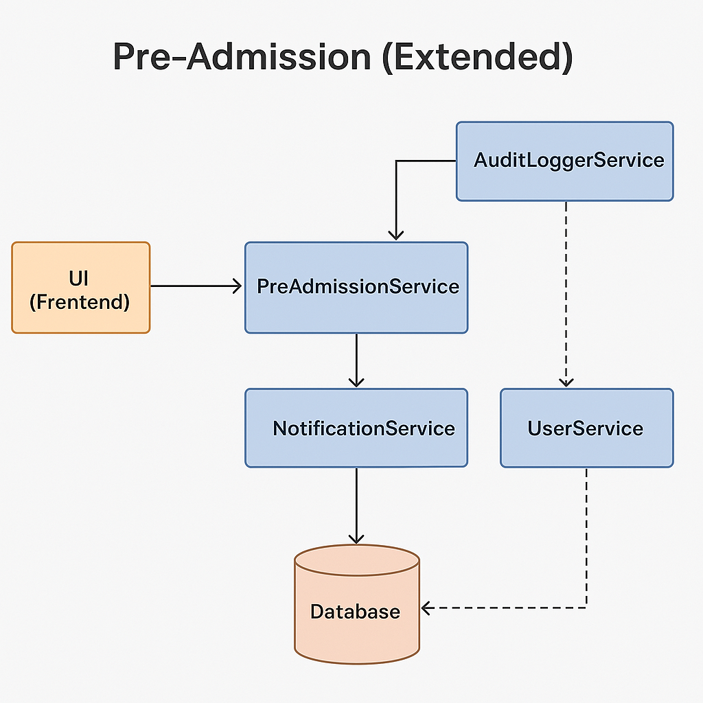

# 📘 Pre-Admission Module – High Level Design

## 🧠 Overview

The Pre-Admission module is responsible for handling leads, tracking follow-ups, and converting interested individuals into enrolled students. It is the first step in the student lifecycle for any educational institution using the Instyte CRM platform.

---

## 🎯 Objectives

- Capture inquiries (leads) from potential students
- Assign counselors to handle leads
- Schedule and track follow-ups
- Convert leads into students or mark as dropped

---

## 🧩 Key Components

| Component              | Responsibility                                  |
|------------------------|--------------------------------------------------|
| **UI (Frontend)**      | Lead form, counselor dashboard, follow-up views |
| **PreAdmissionService**| Core logic for leads and follow-ups             |
| **NotificationService**| (Optional) Sends reminders to counselors         |
| **AuditLoggerService** | Logs lead-related actions for traceability       |
| **UserService**        | Counselor/user data                             |
| **PostgreSQL DB**      | Multi-schema data storage                        |

---

## 🔄 Process Flow

### 📝 Creating a Lead
1. User submits a form via the website/app
2. `PreAdmissionService` receives the request
3. Lead is validated and saved to the database
4. Assigned counselor is notified

### 🔁 Follow-Up Handling
1. Counselor schedules follow-up
2. System sends reminder notifications (if enabled)
3. Counselor updates status after call/meeting

### ✅ Conversion
1. Lead is marked as "Converted"
2. Data is passed to the Student Management module

---

## 📊 Database Entities (Simplified)

### `leads`
| Column      | Type       | Description              |
|-------------|------------|--------------------------|
| id          | UUID       | Primary Key              |
| name        | TEXT       | Name of the lead         |
| email       | TEXT       | Email ID                 |
| phone       | TEXT       | Contact number           |
| status      | ENUM       | [New, InProgress, Converted, Dropped] |
| created_at  | TIMESTAMP  | Creation time            |
| source         | TEXT    | How lead was generated   |
| interest_level | ENUM    | High / Medium / Low      |
| score          | INTEGER | Calculated lead score    |

### `follow_ups`
| Column       | Type      | Description               |
|--------------|-----------|---------------------------|
| id           | UUID      | Primary Key               |
| lead_id      | UUID      | Foreign Key (leads.id)    |
| notes        | TEXT      | Notes from counselor      |
| next_contact | TIMESTAMP | Scheduled next contact    |
| next_contact | TIMESTAMP  | Next follow-up date/time  |
| notification_sent | BOOLEAN    | Flag if reminder was triggered |

---

## 🖼️ Diagrams

- **[Component Diagram](./component-diagram.png)** – Shows how services connect
- 
- **[Sequence Diagram](./sequence-diagram.png)** – Illustrates the "Create Lead" flow

## 🎯 Extended Objectives

- Lead scoring and interest classification
- Track source of inquiry (e.g., ad, referral)
- Counselor follow-up scheduling and reminders
- Notification triggers for follow-ups
- Action history and audit trail

### `lead_audit_trail`
| Column         | Type       | Description                          |
|----------------|------------|--------------------------------------|
| id             | UUID       | Unique audit record                  |
| lead_id        | UUID       | FK to leads                          |
| action         | TEXT       | Action type: create / follow-up etc. |
| user_id        | UUID       | Counselor/system user                |
| timestamp      | TIMESTAMP  | Action time                          |

---

## 🔁 Follow-Up Flow

1. Counselor adds follow-up with next contact time
2. System logs the action in `lead_audit_trail`
3. Optional: NotificationService sends reminder
4. Follow-up response is saved with notes
5. Status may be updated to converted/dropped

---

## 🧠 Future AI Integration

- Smart lead scoring based on demographics
- Automated nudge suggestions
- Dropout prediction modeling

---

> 🧠 This module is the entry point of the Instyte platform and sets the foundation for the complete student lifecycle.
